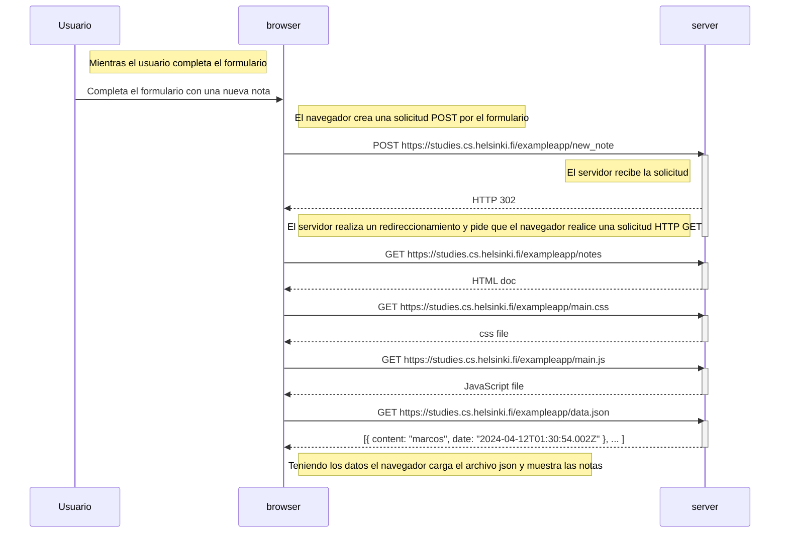

```mermaid

    sequenceDiagram

    Note right of Usuario: Mientras el usuario completa el formulario
    Usuario->>browser: Completa el formulario con una nueva nota

    Note right of browser: El navegador crea una solicitud POST por el formulario
    browser->>server: POST https://studies.cs.helsinki.fi/exampleapp/new_note
    activate server
    Note left of server: El servidor recibe la solicitud
    server-->>browser: HTTP 302
    Note left of server:  El servidor realiza un redireccionamiento y pide que el navegador realice una solicitud HTTP GET
    deactivate server
    
    browser->>server: GET https://studies.cs.helsinki.fi/exampleapp/notes
    activate server
    server-->>browser: HTML doc
    deactivate server

    browser->>server: GET https://studies.cs.helsinki.fi/exampleapp/main.css
    activate server
    server-->>browser: css file
    deactivate server

    browser->>server: GET https://studies.cs.helsinki.fi/exampleapp/main.js
    activate server
    server-->>browser: JavaScript file
    deactivate server

    browser->>server: GET https://studies.cs.helsinki.fi/exampleapp/data.json
    activate server
    server-->>browser: [{ content: "marcos", date: "2024-04-12T01:30:54.002Z" }, ... ]
    deactivate server
    Note right of browser: Teniendo los datos el navegador carga el archivo json y muestra las notas
    
```
