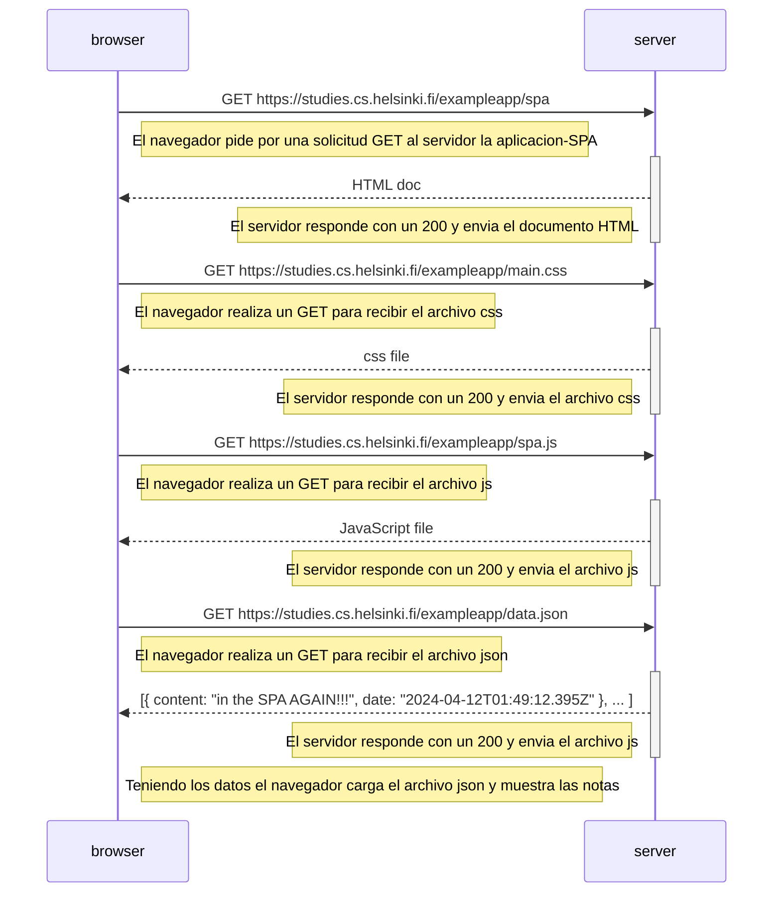

```mermaid

    sequenceDiagram
    
    browser->>server: GET https://studies.cs.helsinki.fi/exampleapp/spa
    Note right of browser: El navegador pide por una solicitud GET al servidor la aplicacion-SPA
    activate server
    server-->>browser: HTML doc
    Note left of server: El servidor responde con un 200 y envia el documento HTML
    deactivate server

    browser->>server: GET https://studies.cs.helsinki.fi/exampleapp/main.css
    Note right of browser: El navegador realiza un GET para recibir el archivo css
    activate server
    server-->>browser: css file
    Note left of server: El servidor responde con un 200 y envia el archivo css
    deactivate server

    browser->>server: GET https://studies.cs.helsinki.fi/exampleapp/spa.js
    Note right of browser: El navegador realiza un GET para recibir el archivo js
    activate server
    server-->>browser: JavaScript file
    Note left of server: El servidor responde con un 200 y envia el archivo js
    deactivate server

    browser->>server: GET https://studies.cs.helsinki.fi/exampleapp/data.json
    Note right of browser: El navegador realiza un GET para recibir el archivo json
    activate server
    server-->>browser: [{ content: "in the SPA AGAIN!!!", date: "2024-04-12T01:49:12.395Z" }, ... ]
    Note left of server: El servidor responde con un 200 y envia el archivo js
    deactivate server
    Note right of browser: Teniendo los datos el navegador carga el archivo json y muestra las notas
    
```
