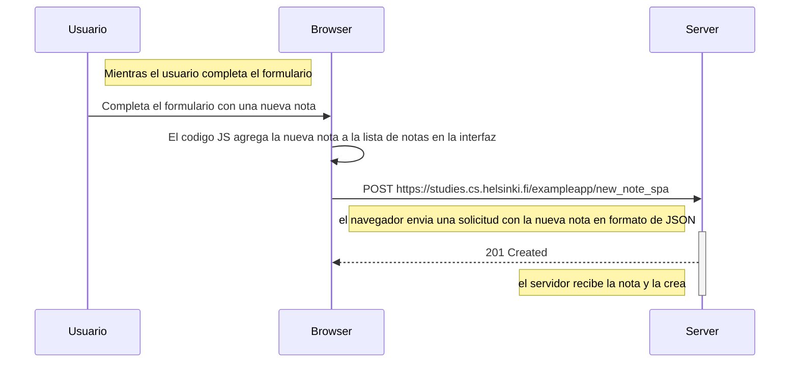

```mermaid

    sequenceDiagram

    Note right of Usuario: Mientras el usuario completa el formulario
        Usuario->>Browser: Completa el formulario con una nueva nota
        Browser->>Browser: El codigo JS agrega la nueva nota a la lista de notas en la interfaz
    

    Browser->>Server: POST https://studies.cs.helsinki.fi/exampleapp/new_note_spa
    Note right of Browser: el navegador envia una solicitud con la nueva nota en formato de JSON
    activate Server
    Server-->>Browser: 201 Created
    Note left of Server: el servidor recibe la nota y la crea
    deactivate Server


    
    
```
